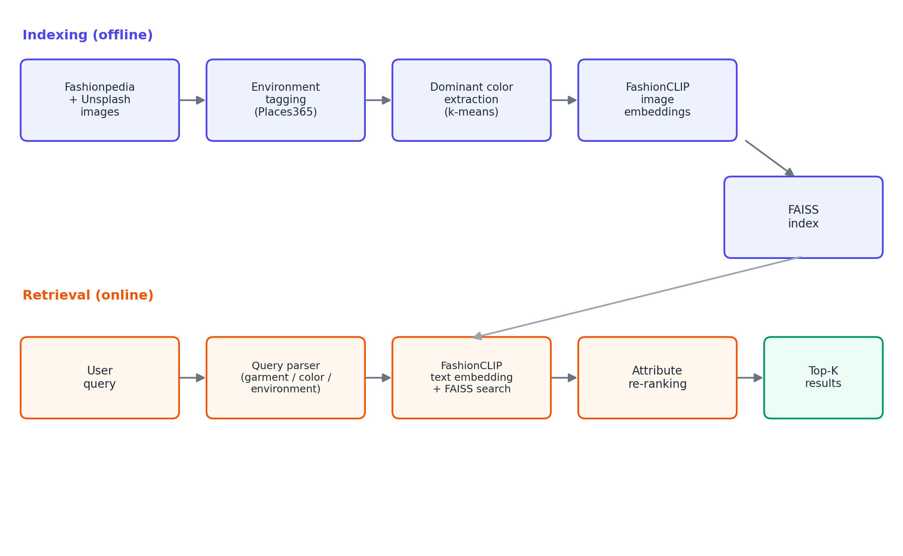
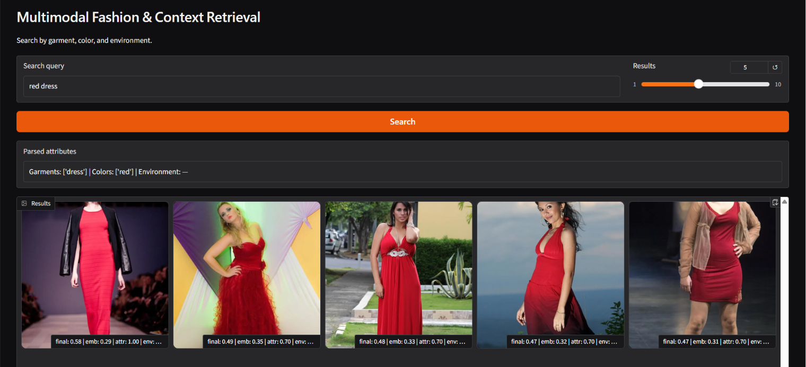

# Multimodal Fashion & Context Retrieval

Search fashion images with natural-language queries that combine **garment type, color, and
environment/setting** — e.g. *"A person in a bright yellow raincoat"* or *"Professional business
attire inside a modern office."*

Built as part of the Glance ML Internship Assignment.

**🔗 Live demo:** [huggingface.co/spaces/Sunaina792/fashion-context-search](https://huggingface.co/spaces/Sunaina792/fashion-context-search)


---

## Overview

Most text-to-image search struggles with **compositional queries** — a query that asks for
several attributes at once (garment + color + setting) often gets matched on whichever attribute
dominates the image visually, and misses the rest. This project handles that by combining two
signals instead of relying on either alone:

1. **FashionCLIP embedding search** — finds images that are semantically close to the query,
   tolerant to paraphrasing and unseen phrasing.
2. **Rule-based attribute re-ranking** — re-scores the shortlist against explicitly extracted
   garment / color / environment tags, correcting cases where the embedding match is close in
   "vibe" but wrong on a specific requested attribute.

<p align="center">
  
</p>

## How it works

### Indexing (offline — see [`notebook/`](./notebook))

| Step | What happens |
|---|---|
| **Dataset** | 700-image subset of [Fashionpedia](https://huggingface.co/datasets/detection-datasets/fashionpedia), augmented with additional Unsplash images for environment buckets (office / home / park / street) that were under-represented in Fashionpedia |
| **Environment tagging** | Pretrained Places365 ResNet-18 classifies each Fashionpedia image's scene, mapped into 4 target buckets via keyword grouping. Unsplash images are tagged directly from their fetch query |
| **Color extraction** | K-means over each garment's bounding box crop finds the dominant color, snapped to the nearest of 12 named colors |
| **Embeddings** | [`patrickjohncyh/fashion-clip`](https://huggingface.co/patrickjohncyh/fashion-clip) — a CLIP checkpoint fine-tuned on fashion imagery — embeds every image |
| **Indexing** | Normalized embeddings are stored in a FAISS `IndexFlatIP` (cosine similarity via inner product) |

### Retrieval (online — see [`app.py`](./app.py))

| Step | What happens |
|---|---|
| **Query parsing** | Rule-based extraction of garment / color / environment keywords, with a synonym table (*"raincoat"* → *"coat"*, *"mustard"* → *"yellow"*) and soft style-to-garment hints (*"casual"* → sweater/shoe/pants) |
| **Embedding search** | Query is embedded with FashionCLIP's text encoder and compared against the full FAISS index |
| **Attribute re-ranking** | Each candidate is scored against the parsed attributes (garment weighted highest, then color, then environment) and blended with the embedding similarity (`0.6 * embedding + 0.4 * attribute`) |
| **Result** | Top-K images returned, ranked by the fused score |

## Results

Two example queries run against the deployed app — note how the results shift based on
which attributes are parsed from the query, and how the attribute score (`attr`) boosts
images that match the requested garment/color even when the raw embedding similarity
(`emb`) alone wouldn't have ranked them highest.

**Query: "red dress"**
> Parsed attributes: `Garments: ['dress'] | Colors: ['red'] | Environment: —`

<p align="center">
  
</p>

**Query: "Professional business attire inside a modern office."**
> Parsed attributes: `Garments: — | Colors: — | Environment: office`

<p align="center">
  
</p>

## Repository structure

```
fashion-context-retrieval/
├── notebook/                  # End-to-end indexing pipeline (Colab/Jupyter)
├── app.py                     # Gradio retrieval UI — reuses the query parser
│                               # and attribute re-ranker from the notebook
├── requirements.txt           # Pinned dependencies
├── fashion_index.faiss        # Prebuilt FAISS index (generated by the notebook)
├── metadata.json              # Per-image metadata: garment/color/environment tags
├── images/                    # Indexed image files
└── README.md
```

## Getting started

### Run the search UI locally

```bash
git clone https://github.com/Sunaina792/fashion-context-retrieval.git
cd fashion-context-retrieval

pip install -r requirements.txt
python app.py
```

This loads the prebuilt `fashion_index.faiss` and `metadata.json`, so no re-indexing is needed —
the app is ready to query as soon as it starts.

### Rebuild the index from scratch

Open [`notebook/`](./notebook) in Google Colab (GPU runtime recommended: *Runtime → Change
runtime type → T4 GPU*) and run all cells top to bottom. You'll need a free
[Unsplash API key](https://unsplash.com/developers) for the environment-bucket augmentation step.
The notebook exports a fresh `fashion_index.faiss` and `metadata.json` at the end.

## Example queries

```
A person in a bright yellow raincoat.
Professional business attire inside a modern office.
Someone wearing a blue shirt sitting on a park bench.
Casual weekend outfit for a city walk.
A red tie and a white shirt in a formal setting.
```

## Design notes & trade-offs

A pure embedding-similarity search was tried first — simplest to implement and generalizes well
to unseen phrasing, but weak on compositional queries where multiple attributes are specified
together. A fully rule-based tag-filter approach was also considered — precise and explainable,
but brittle to synonyms and phrasings the tagger didn't anticipate. The hybrid approach used here
trades implementation complexity (needing both an embedding index and a metadata/attribute
pipeline) for meaningfully better precision on multi-attribute queries, which is the dominant
query style in this task.

## Future work

- **Location & weather:** extend the query parser with NER for city/place names and add a
  weather/season tag at index time, plus a soft cross-attribute term so location/weather can
  influence expected garment choice (e.g. cold cities → heavier garments) even without an
  explicit garment keyword.
- **Precision:** learn the re-ranking weights instead of hand-tuning them, add a garment
  segmentation step before color extraction to reduce background/shadow noise, replace the
  keyword-based query parser with a small fine-tuned attribute extractor, and build a labeled
  evaluation set beyond the 5 assignment queries to actually measure precision changes.
- **Scale:** move from an exact FAISS `IndexFlatIP` to an approximate index (HNSW / IVF-PQ) if
  the dataset grows well beyond the current ~800 images.

## Tech stack

`Fashionpedia` · `Places365` · `FashionCLIP` · `FAISS` · `Gradio` · `Hugging Face Spaces`
